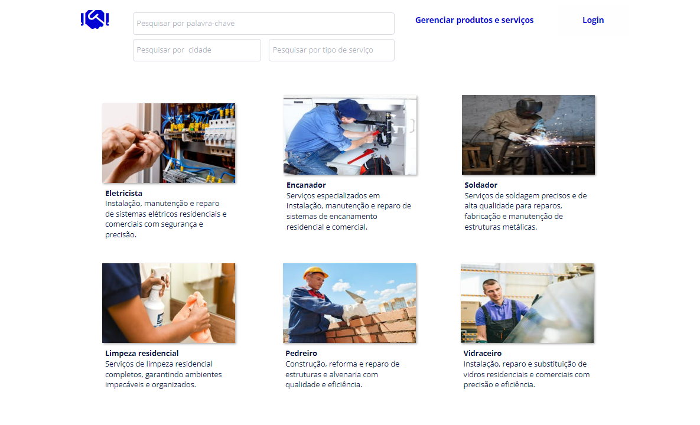

# Reconstrói RS
**Conectando prestadores de serviços e lojas parceiras com quem mais precisa**

---

## 👨‍💻 Tech Pelo RS

Esse projeto faz parte do MVP para o [Hackathon Tech Pelo RS](https://github.com/TechPeloRS/maratona-pelo-rs), desenvolvido nos dias 25 e 26.

A proposta do Hackathon foi impulsionar soluções inovadoras de tecnologia para oferecer atendimento e suporte a milhares de pessoas afetadas pelas chuvas e inundações que atingiram o Rio Grande do Sul.

## 🤝 Reconstrói RS
Estima-se que mais de 2.1 milhões de pessoas, e 600 mil micro e pequenas empresas foram afetadas diretamente pela enchentes no Rio Grande do Sul.
Quando a água baixar, será necessário limpar, reparar e recomeçar as vidas que foram interrompidas.

Muitas pessoas estão dispostas a cobrar menos por seus serviços e produtos, ou mesmo disponibilizá-los de forma voluntária, e acabam se limitando a fazer a divulgação de forma orgânica em redes sociais, o que acaba dificultando alcance e acesso de ambas as partes.

Nossa solução é um sistema que **conecta prestadores de serviço e lojas com quem mais precisa**, auxiliando a **Recuperação de Bem-estar Social e Econômico**.

O sistema é uma aplicação web na qual prestadores de serviço e lojas, dispostos a ajudar no processo de reconstrução pós-calamidade, podem publicar seus serviços e produtos de forma organizada e acessível.
As pessoas que necessitam podem acessar e consultar todos os anúncios, encontrando e entrando em contato diretamente com os prestadores de serviço ou lojas. 

## 🎯 MVP

Devido ao tempo limitado para a implementação do MVP, decidimos que fariamos o Front-End com Low Code, e uma Web API para fazer o acesso e manipulação dos dados em um Banco de Dados.

A implementação desenvolvida foi apenas para provar a viabilidade do sistema, e não é funcional.

## ⚙️ Funcionalidades

### Para prestadores de serviço ou lojas
- Cadastro e Login
- Registro de anúncios
- Edição de anúncios
- Remoção de anúncios

### Para todos
- Busca de anúncios
- Busca de anúncios por palavra chave, cidade de atuação e tipo de serviço
- Redirecionamento para contato com anunciante

## 🛠️ Tecnologias usadas

### Front-End
- Bubble

### Back-End
- ASP.NET Web API
- .NET 8.0
- SQL Server
- Entity Framework

## 📋 API Endpoints

###  Serviço
- `GET /api/Service`: Obtém a lista de serviços (filtrada ou não).
- `POST /api/Service`: Cria um novo serviço.
- `GET /api/Service/{id}`: Obtém um serviço pelo ID.
- `PUT /api/Service/{id}`: Atualiza um serviço pelo ID.
- `DELETE /api/Service/{id}`: Remove um serviço pelo ID.

### Usuário
- `GET /api/User`: Obtém a lista de usuários.
- `POST /api/User`: Cria um novo usuário.
- `GET /api/User/{id}`: Obtém um usuário pelo ID.
- `PUT /api/User/{id}`: Atualiza um usuário pelo ID.
- `DELETE /api/User/{id}`: Remove um usuário pelo ID.
- `GET /api/User/{id}/services`: Obtém os serviços de um usuário pelo ID.